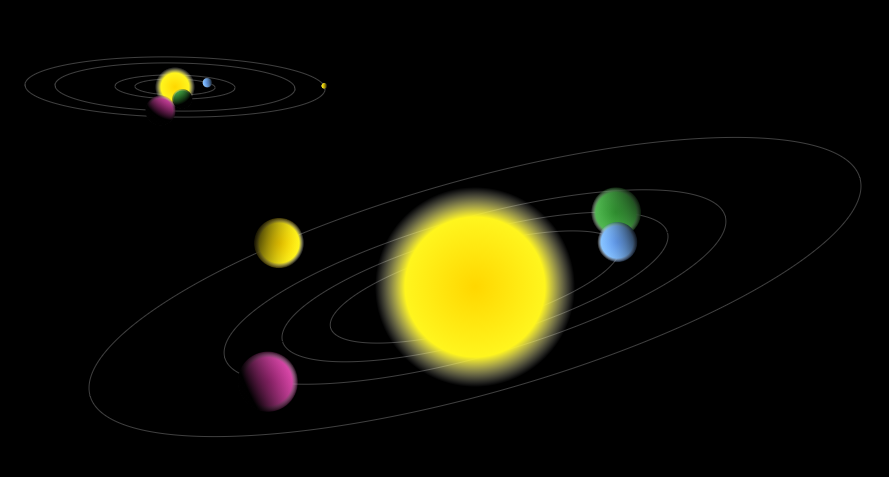

# Planet-Animation-Canvas2D-and-React
Planet animation from JSON data. Rendering provided by React as example. Ellipse, ecliptic angle and direction of rotation calculated from star parameters (as seed).

Code well commented.

